| Field | Value |
|-------|-------|
| **Project Name** | MobilePentest Crew |
| **Version** | 1.2.0 |
| **Date** | 2026-05-03 |
| **Author** | 0x3n0 |
| **Changelog** | v1.2.0 — Fix kontradiksi G4 vs Out of Scope, physical device fallback (ADB factory reset tidak valid), revisi NF-001/002 timing realistis, elevasi F-011 ke P0 & F-016 ke P1, perbaiki mitigasi LLM Hallucination menjadi otomatis, tambah Obfuscation Handling Strategy, Logging & Audit Trail, Certificate Management untuk MITM, Scan Scope Configuration, Compliance Mapping, Data Retention Policy |
| **Previous** | v1.1.0 — RAG/Knowledge Base, Device Management, DevSecOps Output, Agent Feedback Loop |

---

## 1. Overview

### 1.1 Problem Statement

Manual penetration testing pada mobile applications membutuhkan waktu yang lama, konsistensi yang rendah, dan ketergantungan pada skill individu tester. Proses ini seringkali:

- Memakan waktu 2-4 minggu per aplikasi
- Tidak terstandarisasi antar tester
- Mudah miss attack vector tertentu
- Sulit di-reproduce hasilnya
- Pengetahuan agent terbatas pada training data LLM yang bisa sudah usang
- Tidak ada mekanisme self-correction jika satu fase gagal
- Hasil tidak langsung bisa diintegrasikan ke pipeline DevSecOps

### 1.2 Solution

Membangun sistem **multi-agent** menggunakan **CrewAI** yang mengotomasi seluruh workflow penetration testing mobile apps — dari reconnaissance hingga reporting — dengan role agen yang terdefinisi jelas, kolaboratif, dilengkapi **Vulnerability Knowledge Base (RAG)**, **mekanisme Feedback Loop antar-agent**, **Device Environment Manager**, dan **output format terintegrasi DevSecOps**.

### 1.3 Goals

| # | Goal | Success Metric |
|---|------|----------------|
| G1 | Mengotomasi 80%+ tahapan pentest mobile | Tahapan ter-automasi vs manual OWASP MASTG |
| G2 | Mengurangi waktu testing dari minggu ke hari | Rata-rata waktu per app < 2 hari |
| G3 | Menghasilkan laporan yang konsisten dan actionable | Format laporan terstandarisasi |
| G4 | Mendukung Android (v1.0), iOS roadmap v2.0 | Android ter-cover penuh; iOS modul didesain extensible |
| G5 | Agent tetap up-to-date dengan teknik terbaru | RAG di-update minimal 1x/minggu |
| G6 | Output dapat langsung diimport ke DevSecOps tools | Support JSON/SARIF/DefectDojo |
| G7 | Agent dapat self-correct jika task gagal | Retry + feedback loop ter-trigger otomatis |
| G8 | Environment device stabil selama testing | Auto-reset/snapshot revert < 5 menit |

---

## 2. System Architecture

### 2.1 High-Level Architecture

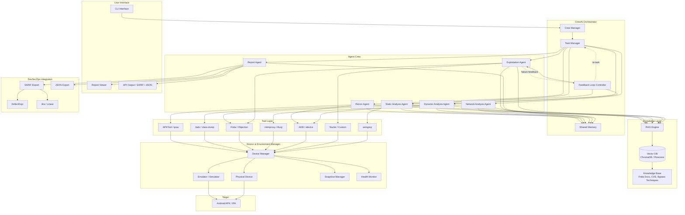

### 2.2 Agent Workflow (with Feedback Loop)

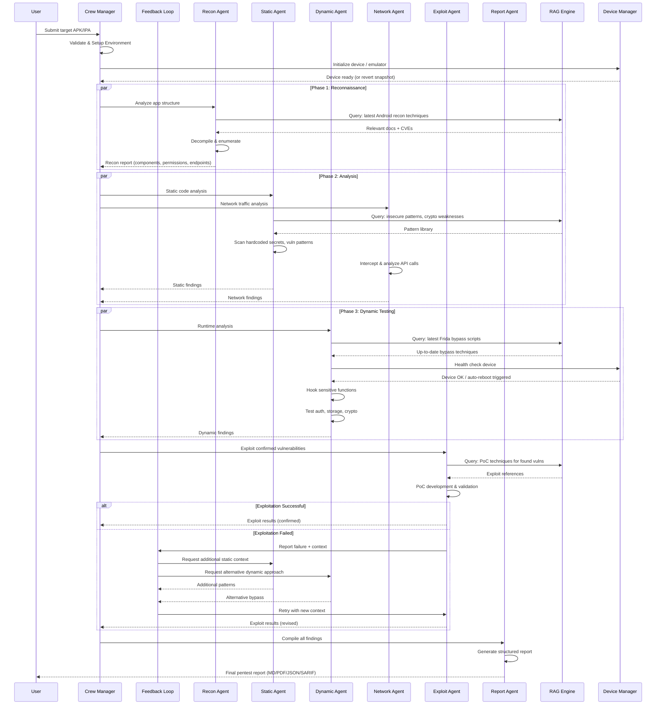

---

## 3. Agent Specifications

### 3.1 Agent Roles

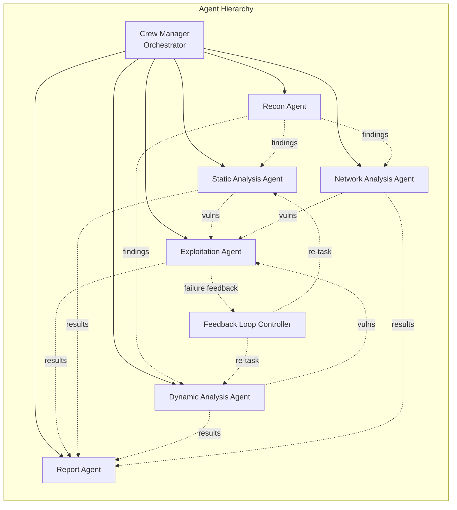

#### 3.1.1 Recon Agent

| Property | Detail |
|----------|--------|
| **Role** | Mobile App Reconnaissance Specialist |
| **Goal** | Memetakan seluruh attack surface aplikasi |
| **Backstory** | Expert dalam reverse engineering mobile apps |
| **Tools** | APKTool, ipsw, ADB, ideviceinstaller, RAG Query Tool |

**Responsibilities:**
- Decompile APK/IPA
- Extract AndroidManifest.xml / Info.plist
- Enumerate: Activities, Services, Broadcast Receivers, Content Providers
- Identify: Permissions, exported components, deeplinks
- Extract hardcoded URLs, API keys, certificates
- Query RAG untuk teknik recon terbaru dan CVE yang relevan

#### 3.1.2 Static Analysis Agent

| Property | Detail |
|----------|--------|
| **Role** | Source Code Security Analyst |
| **Goal** | Menemukan vulnerability tanpa menjalankan aplikasi |
| **Backstory** | Senior mobile security auditor dengan pengalaman 10+ tahun |
| **Tools** | jadx, class-dump, semgrep, grep patterns, RAG Query Tool |

**Responsibilities:**
- Scan hardcoded secrets (API keys, tokens, passwords)
- Detect insecure cryptographic implementations
- Identify SQL injection patterns
- Check for insecure data storage patterns
- Analyze certificate pinning implementation
- Detect obfuscation level & potential bypass
- Query RAG untuk pattern kerentanan terkini (CWE/CVE terbaru)
- Menerima **re-task dari Feedback Loop** jika Exploitation Agent gagal

#### 3.1.3 Dynamic Analysis Agent

| Property | Detail |
|----------|--------|
| **Role** | Runtime Security Tester |
| **Goal** | Menemukan vulnerability saat aplikasi berjalan |
| **Backstory** | Specialist dalam runtime manipulation dan hooking |
| **Tools** | Frida, Objection, ADB logcat, RAG Query Tool, Device Health Tool |

**Responsibilities:**
- Bypass root/jailbreak detection
- Test authentication mechanisms
- Analyze local data storage at runtime
- Test session management
- Hook sensitive API calls
- Test biometric bypass
- Verify encryption key storage
- Query RAG untuk **script Frida terbaru** dan bypass technique ter-update
- Menerima **re-task dari Feedback Loop** dengan pendekatan alternatif jika gagal
- Cek status device melalui Device Manager sebelum eksekusi hook

#### 3.1.4 Network Analysis Agent

| Property | Detail |
|----------|--------|
| **Role** | Network Security Analyst |
| **Goal** | Menganalisis keamanan komunikasi jaringan |
| **Backstory** | Network security expert fokus mobile traffic |
| **Tools** | mitmproxy, Burp Suite CLI, tcpdump, RAG Query Tool |

**Responsibilities:**
- Intercept HTTPS traffic
- Detect certificate pinning bypass
- Analyze API authentication mechanisms
- Test for man-in-the-middle vulnerabilities
- Validate TLS configuration
- Check for sensitive data in transit
- Query RAG untuk teknik bypass certificate pinning terkini

#### 3.1.5 Exploitation Agent

| Property | Detail |
|----------|--------|
| **Role** | Vulnerability Exploitation Specialist |
| **Goal** | Membuktikan vulnerability dengan PoC |
| **Backstory** | Offensive security researcher |
| **Tools** | Frida scripts, custom exploits, nuclei, RAG Query Tool |

**Responsibilities:**
- Develop Proof of Concept untuk confirmed vulns
- Chain vulnerabilities untuk impact assessment
- Validate false positives
- Assess real-world impact (CVSS scoring)
- Query RAG untuk referensi exploit terbaru
- **Kirim feedback ke Feedback Loop Controller** jika bypass gagal, beserta:
  - Teknik yang sudah dicoba
  - Error/response yang diterima
  - Hipotesis mengapa gagal
  - Konteks yang dibutuhkan dari agent lain

#### 3.1.6 Report Agent

| Property | Detail |
|----------|--------|
| **Role** | Security Report Writer |
| **Goal** | Menghasilkan laporan yang actionable dan dapat diimport ke DevSecOps tools |
| **Backstory** | Technical writer dengan background security |
| **Tools** | Markdown generator, PDF renderer, JSON/SARIF exporter, template engine |

**Responsibilities:**
- Aggregate findings dari semua agent
- Classify severity (Critical/High/Medium/Low/Info)
- Generate executive summary
- Provide remediation recommendations
- Map findings ke OWASP MASTG categories
- Generate output dalam format: **Markdown, PDF, JSON, SARIF**
- Format JSON/SARIF agar kompatibel dengan DefectDojo dan Jira

---

### 3.2 Feedback Loop Controller

Komponen non-agent yang dikelola oleh Crew Manager untuk menangani kegagalan task secara rekursif.

#### 3.2.1 Mekanisme Feedback Loop

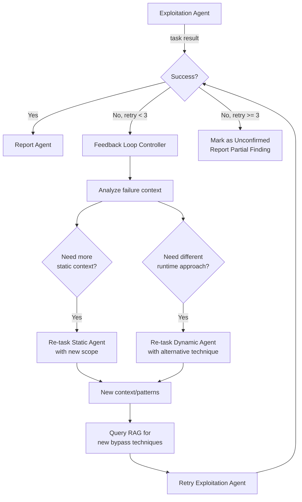

#### 3.2.2 Feedback Payload Schema

```json
{
  "feedback_id": "uuid",
  "source_agent": "exploitation_agent",
  "target_vuln_id": "VULN-042",
  "attempt_number": 2,
  "techniques_tried": ["frida-bypass-v1", "objection-root-bypass"],
  "failure_reason": "app crashes on hook attachment — possible integrity check",
  "hypothesis": "Anti-tampering mechanism active beyond root detection",
  "requested_context": {
    "from_static_agent": "anti-tampering patterns in decompiled code",
    "from_dynamic_agent": "alternative hooking approach without attaching to main process"
  },
  "timestamp": "2026-05-03T10:30:00Z"
}
```

#### 3.2.3 Batas Iterasi

| Parameter | Value | Keterangan |
|-----------|-------|------------|
| `max_retry_per_vuln` | 3 | Maksimal percobaan ulang per vulnerability |
| `feedback_timeout` | 10 menit | Timeout menunggu respons agent lain |
| `escalation_behavior` | Mark Unconfirmed | Jika retry habis, temuan dilaporkan sebagai "Suspected / Unconfirmed" |

---

### 3.3 Vulnerability Knowledge Base (RAG)

#### 3.3.1 Arsitektur RAG

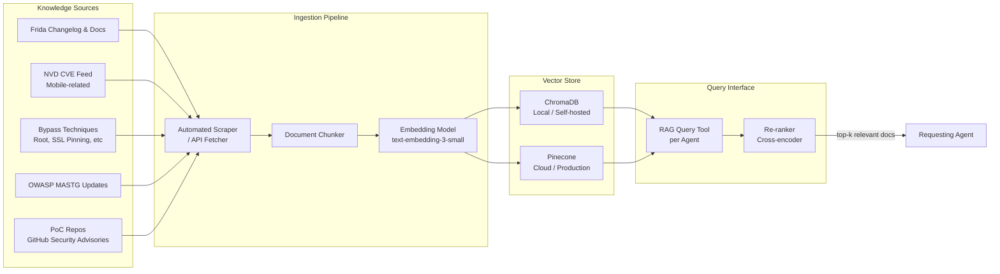

#### 3.3.2 Sumber Data Knowledge Base

| Sumber | Format | Update Frequency | Relevansi |
|--------|--------|-----------------|-----------|
| Frida Official Docs | HTML/MD | Weekly | Dynamic hooking terbaru |
| OWASP MASTG | MD/HTML | Monthly | Test case coverage |
| NVD CVE Feed (mobile) | JSON API | Daily | CVE Android/iOS terbaru |
| GitHub Security Advisories | GraphQL API | Daily | PoC & advisory terbaru |
| Objection Changelog | MD | Weekly | Bypass technique update |
| Android Security Bulletins | HTML | Monthly | Patch & vuln tracking |
| iOS Security Updates | HTML | Monthly | Jailbreak & bypass update |

#### 3.3.3 RAG Query Tool Interface

```python
# Contoh penggunaan di dalam agent tool
rag_tool = RAGQueryTool(
    collection="mobile_pentest_kb",
    top_k=5,
    rerank=True
)

# Query contoh dari Dynamic Analysis Agent
result = rag_tool.query(
    query="latest Frida script bypass SafetyNet attestation 2025",
    filters={"category": "bypass", "platform": "android"}
)
```

---

## 4. Testing Scope (OWASP MASTG)

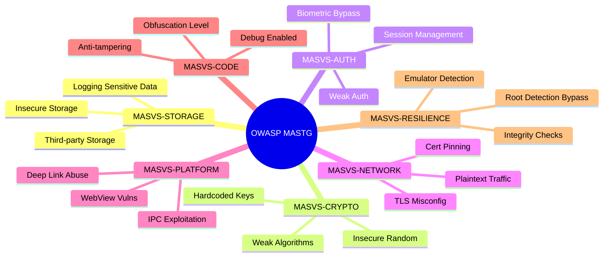

---

## 5. Functional Requirements

### 5.1 Core Features

| ID | Feature | Priority | Description |
|----|---------|----------|-------------|
| F-001 | APK/IPA Input | P0 | Menerima file APK/IPA sebagai target |
| F-002 | Auto Decompile | P0 | Otomatis decompile menggunakan apktool/jadx |
| F-003 | Static Scanning | P0 | Scan source code untuk pattern vulnerability |
| F-004 | Dynamic Hooking | P0 | Runtime hooking dengan Frida |
| F-005 | Network Intercept | P0 | Intercept dan analisis traffic |
| F-006 | Report Generation | P0 | Generate laporan dalam format Markdown/PDF |
| F-007 | OWASP Mapping | P1 | Map setiap finding ke OWASP MASTG |
| F-008 | CVSS Scoring | P1 | Hitung CVSS score otomatis |
| F-009 | Multi-app Batch | P2 | Support batch testing multiple apps |
| F-010 | CI/CD Integration | P2 | Integrasi dengan pipeline CI/CD |
| F-011 | Automated Device Reset/Snapshot | **P0** | Auto-revert emulator ke clean snapshot jika freeze/crash — blocker untuk Dynamic Agent |
| F-012 | RAG Knowledge Base | P1 | Vector DB terintegrasi dengan knowledge mobile security terkini |
| F-013 | JSON/SARIF Export | P1 | Export findings dalam format JSON & SARIF untuk DevSecOps tools |
| F-014 | Agent Feedback Loop | P1 | Mekanisme self-correction rekursif antar-agent jika exploitation gagal |
| F-015 | DefectDojo / Jira Integration | P2 | Push findings langsung ke vulnerability management tools |
| F-016 | RAG Auto-Update Pipeline | **P1** | Scraper otomatis untuk menjaga Knowledge Base fresh — diperlukan agar G5 tercapai |
| F-017 | Scan Scope Configuration | P1 | User dapat mengkonfigurasi scope test: modul MASVS tertentu, severity minimum, mode quick/full |
| F-018 | Obfuscation Detection & Handling | P1 | Deteksi level obfuskasi (ProGuard/DexGuard/RASP) dan pilih strategi deobfuscation yang tepat |
| F-019 | Audit Trail & Logging | P0 | Setiap aksi agent dicatat secara terstruktur untuk audit, debugging, dan chain-of-custody |
| F-020 | Certificate Management (MITM) | P0 | Otomatis install/revoke CA cert per sesi di emulator untuk Network Agent |

### 5.2 Non-Functional Requirements

| ID | Requirement | Target |
|----|-------------|--------|
| NF-001 | Waktu eksekusi (small app, < 20MB) | < 3 jam *(termasuk RAG queries + feedback loop overhead)* |
| NF-002 | Waktu eksekusi (large app, > 100MB) | < 10 jam *(termasuk obfuscation analysis dan multi-retry)* |
| NF-003 | False positive rate | < 15% |
| NF-004 | Coverage OWASP MASTG | > 80% test cases |
| NF-005 | Report accuracy | Actionable & reproducible |
| NF-006 | Device reset time (snapshot revert) | < 5 menit |
| NF-007 | RAG query latency | < 3 detik per query |
| NF-008 | RAG knowledge freshness | Update maksimal 7 hari terakhir |
| NF-009 | Feedback loop max iterations | ≤ 3 retry per vulnerability |
| NF-010 | SARIF output compatibility | SARIF v2.1.0 standard |

---

## 6. Device & Environment Management

### 6.1 Overview

Mobile pentest sangat bergantung pada kestabilan environment device. Sistem harus mampu mendeteksi, memulihkan, dan mengisolasi masalah device secara otomatis agar tidak menghentikan seluruh pipeline testing.

### 6.2 Lifecycle Device Management

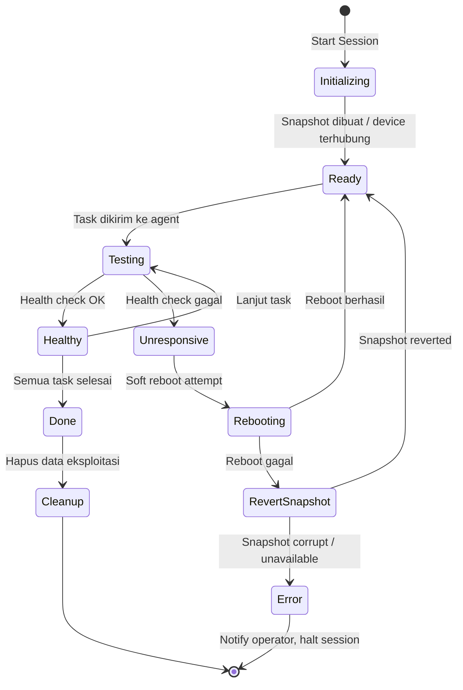

### 6.3 F-011: Automated Device Reset / Snapshot

#### 6.3.1 Snapshot Strategy

| Snapshot Point | Trigger | Deskripsi |
|---------------|---------|-----------|
| `baseline` | Sebelum sesi dimulai | Emulator clean, apps ter-install, tools ready |
| `post-recon` | Setelah Recon Agent selesai | State setelah decompile & setup awal |
| `pre-exploit` | Sebelum Exploitation Agent aktif | Safety snapshot sebelum PoC berjalan |
| `post-session` | Setelah semua agent selesai | Untuk audit/replay jika diperlukan |

#### 6.3.2 Health Monitor

```python
# Pseudocode: Device Health Monitor
class DeviceHealthMonitor:
    check_interval = 30  # seconds
    max_unresponsive = 3  # strikes sebelum reboot

    def check(self, device_id: str) -> DeviceStatus:
        # Cek ADB/idevice responsiveness
        # Cek CPU/memory usage
        # Cek Frida server status
        # Return: HEALTHY | SLOW | UNRESPONSIVE | CRASHED

    def recover(self, device_id: str, status: DeviceStatus):
        if status == UNRESPONSIVE:
            self.soft_reboot(device_id)
        elif status == CRASHED:
            self.revert_snapshot(device_id, "pre-exploit")
        # Notify Crew Manager setelah recovery
```

#### 6.3.3 Konfigurasi Device Manager

```yaml
# configs/device_manager.yaml
device_manager:
  health_check_interval: 30        # detik
  max_unresponsive_strikes: 3
  auto_reboot_enabled: true
  auto_snapshot_revert: true
  snapshot_retention: 3            # jumlah snapshot disimpan
  device_reset_timeout: 300        # 5 menit maksimum recovery time

  emulator:
    provider: "android_sdk"        # atau: genymotion, corellium
    avd_name: "Pentest_AVD_API34"
    snapshot_backend: "avd_snapshots"

  physical_device:
    adb_host: "localhost"
    adb_port: 5037
    snapshot_backend: "none"           # physical device tidak support snapshot
    # CATATAN: factory reset via ADB TIDAK tersedia secara default.
    # Fallback untuk physical device:
    # 1. Uninstall + reinstall target app via ADB
    # 2. Clear app data: adb shell pm clear <package>
    # 3. Reboot device: adb reboot
    # 4. Jika semua gagal: notifikasi operator untuk intervensi manual
    fallback_strategy: "app_reinstall" # options: app_reinstall | reboot | manual_notify
    manual_notify_webhook: "${ALERT_WEBHOOK_URL}"
```

---

## 7. DevSecOps Output Integration

### 7.1 Output Format Matrix

| Format | Use Case | Tools Supported |
|--------|----------|----------------|
| Markdown | Human-readable report | Any |
| PDF | Executive / client delivery | Any |
| **JSON** | Programmatic import, automation | DefectDojo, Jira, custom pipelines |
| **SARIF v2.1.0** | CI/CD gate, SAST integration | GitHub Advanced Security, DefectDojo, VS Code |

### 7.2 JSON Output Schema

```json
{
  "scan_metadata": {
    "tool": "MobilePentest Crew",
    "version": "1.2.0",
    "target": "com.example.app",
    "platform": "android",
    "timestamp": "2026-05-03T12:00:00Z",
    "duration_seconds": 5420,
    "owasp_mastg_version": "2.1"
  },
  "summary": {
    "critical": 2,
    "high": 5,
    "medium": 8,
    "low": 3,
    "info": 12
  },
  "findings": [
    {
      "id": "VULN-001",
      "title": "Hardcoded API Key in source code",
      "severity": "critical",
      "cvss_score": 9.1,
      "cvss_vector": "AV:N/AC:L/PR:N/UI:N/S:U/C:H/I:H/A:N",
      "owasp_category": "MASVS-STORAGE-2",
      "cwe": "CWE-798",
      "description": "...",
      "evidence": {
        "file": "com/example/app/NetworkClient.java",
        "line": 42,
        "snippet": "[REDACTED for brevity]"
      },
      "reproduction_steps": ["..."],
      "remediation": "...",
      "agent_source": "static_analysis_agent",
      "confirmed_by_poc": true,
      "feedback_loop_iterations": 0
    }
  ]
}
```

### 7.3 SARIF v2.1.0 Output

```json
{
  "$schema": "https://raw.githubusercontent.com/oasis-tcs/sarif-spec/master/Schemata/sarif-schema-2.1.0.json",
  "version": "2.1.0",
  "runs": [
    {
      "tool": {
        "driver": {
          "name": "MobilePentest Crew",
          "version": "1.2.0",
          "rules": [
            {
              "id": "MASVS-STORAGE-2",
              "name": "HardcodedSecrets",
              "shortDescription": { "text": "Hardcoded credentials or API keys" },
              "helpUri": "https://mas.owasp.org/MASVS/controls/MASVS-STORAGE-2/"
            }
          ]
        }
      },
      "results": [
        {
          "ruleId": "MASVS-STORAGE-2",
          "level": "error",
          "message": { "text": "Hardcoded API Key found" },
          "locations": [
            {
              "physicalLocation": {
                "artifactLocation": { "uri": "com/example/app/NetworkClient.java" },
                "region": { "startLine": 42 }
              }
            }
          ]
        }
      ]
    }
  ]
}
```

### 7.4 Integrasi DefectDojo & Jira

```python
# tools/devsecops_exporter.py

class DefectDojoExporter:
    """Push findings ke DefectDojo via REST API"""
    def export(self, findings: list[Finding], engagement_id: int):
        # Upload SARIF ke /api/v2/import-scan/
        # Set scan_type = "SARIF"

class JiraExporter:
    """Buat Jira issue per finding Critical/High"""
    def export(self, findings: list[Finding], project_key: str):
        for f in findings:
            if f.severity in ["critical", "high"]:
                self.create_issue(
                    summary=f.title,
                    description=f.description,
                    labels=["security", "mobile-pentest", f.owasp_category],
                    priority=self._map_severity(f.severity)
                )
```

---

## 7a. Scan Scope Configuration (F-017)

User dapat mengkonfigurasi apa yang ingin diuji sebelum sesi dimulai, menghindari full scan yang tidak perlu dan menghemat waktu.

### Scope Configuration Schema

```yaml
# configs/scan_scope.yaml
scan_scope:
  mode: "full"                     # quick | standard | full
  target_apk: "path/to/app.apk"
  package_name: "com.example.app"  # optional override

  # Pilih modul MASVS yang akan ditest
  masvs_modules:
    - MASVS-STORAGE                # aktif
    - MASVS-CRYPTO                 # aktif
    - MASVS-AUTH                   # aktif
    - MASVS-NETWORK                # aktif
    - MASVS-PLATFORM               # aktif
    - MASVS-CODE                   # aktif
    - MASVS-RESILIENCE             # aktif (set false untuk skip anti-tampering)

  # Filter severity minimum yang masuk laporan
  min_severity_to_report: "low"    # info | low | medium | high | critical

  # Agent yang diaktifkan
  agents_enabled:
    recon: true
    static: true
    dynamic: true
    network: true
    exploitation: true

  # Batas waktu per agent (menit)
  agent_timeout:
    recon: 30
    static: 60
    dynamic: 90
    network: 45
    exploitation: 60

  # Mode quick: hanya jalankan static + recon, skip dynamic & exploitation
  quick_mode_agents: ["recon", "static", "network"]
```

### Mode Presets

| Mode | Agent Aktif | Estimasi Waktu | Use Case |
|------|-------------|----------------|----------|
| `quick` | Recon, Static, Network | < 45 menit | CI/CD pipeline gate, initial triage |
| `standard` | Semua kecuali Exploitation | < 3 jam | Review rutin, internal testing |
| `full` | Semua agent + feedback loop | < 10 jam | Release testing, audit formal |

---

## 7b. Obfuscation Detection & Handling Strategy (F-018)

Salah satu tantangan terbesar mobile pentest adalah aplikasi yang di-obfuscate (ProGuard, DexGuard, R8) atau dilindungi RASP. Tanpa strategi yang jelas, agent akan waste waktu pada kode yang tidak dapat dibaca.

### 7b.1 Detection & Classification

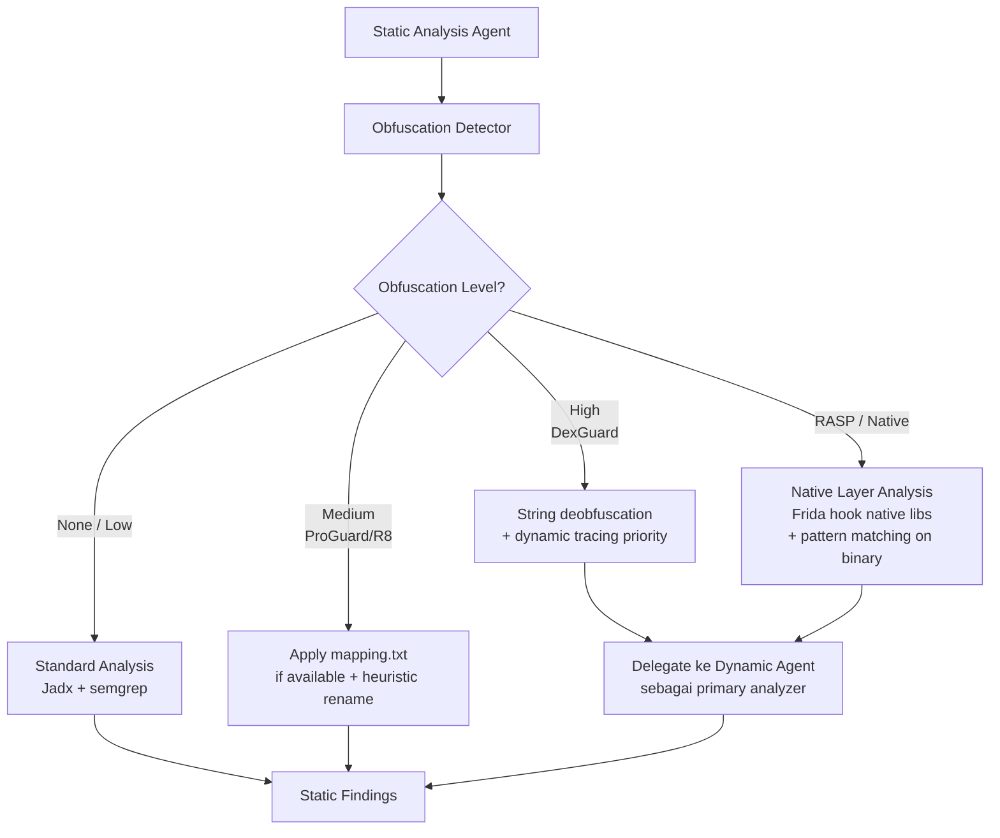

### 7b.2 Obfuscation Level Matrix

| Level | Indikator | Tool Primary | Strategi |
|-------|-----------|-------------|---------|
| **None** | Class/method names meaningful | jadx + semgrep | Standard static analysis |
| **Light (ProGuard/R8)** | Short names (a, b, c), mapping.txt tersedia | jadx + mapping file | Apply renaming, semgrep pada hasil |
| **Medium (ProGuard heavy)** | Nama acak, string enkripsi ringan | jadx + frida string hook | String decryption via Frida hook |
| **Heavy (DexGuard)** | Semua nama acak, string terenkripsi, flow obfuscation | Frida primary | Dynamic tracing jadi primary, static sebagai pendukung |
| **RASP / Native** | NDK libs, anti-debugging, runtime check | Frida + Binary analysis | Hook native fungsi, bypass anti-debug, binary pattern matching |

### 7b.3 Integration dengan Static & Dynamic Agent

- **Static Agent** mendeteksi level obfuskasi di tahap awal dan menyertakannya dalam output ke Shared Memory.
- Jika level `HIGH` atau `RASP`, Static Agent **mendelegasikan prioritas** ke Dynamic Agent.
- Dynamic Agent menerima flag `obfuscation_level` dari Shared Memory dan menyesuaikan teknik hooking.
- Jika `mapping.txt` ditemukan dalam APK atau disuplai user, Recon Agent mengekstraknya dan meneruskan ke Static Agent.

---

## 7c. Certificate Management untuk MITM (F-020)

Network Agent membutuhkan CA certificate ter-install di device/emulator untuk dapat melakukan MITM dan menganalisis traffic HTTPS. Tanpa manajemen cert yang proper, setiap sesi akan gagal atau butuh setup manual.

### 7c.1 Lifecycle Certificate per Sesi

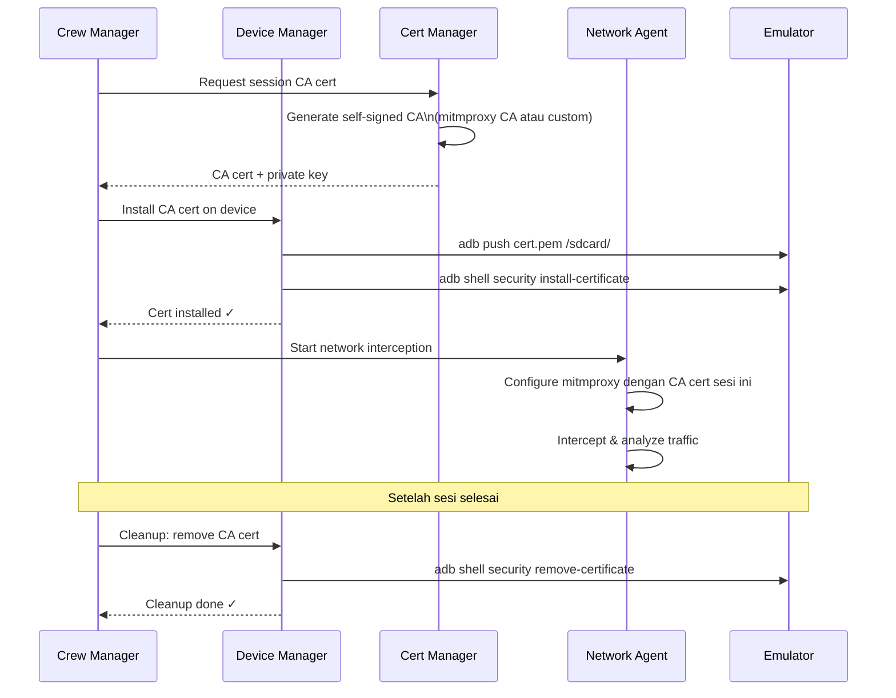

### 7c.2 Konfigurasi Certificate Manager

```yaml
# configs/cert_manager.yaml
cert_manager:
  ca_backend: "mitmproxy"          # mitmproxy | custom_ca | burp
  cert_lifetime_hours: 24          # Cert expired setelah sesi
  auto_install: true               # Auto-install ke emulator
  auto_cleanup: true               # Auto-revoke setelah sesi

  android:
    install_method: "user_cert"    # user_cert (API < 24) | system_cert (root required)
    # Untuk Android 7+ dengan network_security_config:
    inject_nsc: true               # Inject network_security_config.xml via APK repackaging
    nsc_inject_tool: "apk-resign"

  ios_future:                      # Placeholder untuk v2.0
    install_method: "simulator_trust"
    trust_anchor: "system"

  # Penanganan Certificate Pinning
  cert_pinning:
    auto_bypass_attempt: true      # Coba bypass otomatis via Frida
    bypass_scripts:
      - "ssl-kill-switch3"
      - "objection-ssl-pinning"
    fallback: "report_as_finding"  # Jika bypass gagal, catat sebagai finding
```

### 7c.3 Handling Certificate Pinning

| Skenario | Aksi Otomatis | Fallback |
|----------|--------------|----------|
| Tidak ada pinning | Langsung intercept | — |
| Pinning via `OkHttp` / `NSURLSession` | Jalankan Frida script bypass | Report finding jika gagal |
| Pinning via native (NDK) | Hook native SSL functions | Report sebagai High finding |
| Custom pinning logic | Analisis kode via Static Agent, buat custom bypass | Report sebagai High finding |

---

## 7d. Logging & Audit Trail (F-019)

Setiap tool keamanan yang digunakan di lingkungan profesional harus memiliki audit trail yang lengkap. Log ini penting untuk forensik, debugging, dan chain-of-custody jika temuan dipertanyakan.

### 7d.1 Log Levels & Kategori

| Kategori Log | Level | Konten | Retensi |
|-------------|-------|--------|---------|
| `agent.action` | INFO | Setiap aksi yang dilakukan agent (tool dipanggil, query RAG, dst) | 90 hari |
| `agent.finding` | INFO | Setiap finding yang ditemukan + confidence score | 1 tahun |
| `tool.execution` | DEBUG | Command yang dijalankan + output raw | 30 hari |
| `tool.error` | ERROR | Error tool + stack trace | 90 hari |
| `feedback_loop` | INFO | Feedback payload + hasil iterasi | 90 hari |
| `device.event` | INFO | Health check result, reboot, snapshot events | 30 hari |
| `session` | INFO | Start/end sesi, konfigurasi, user identity | 1 tahun |
| `security.audit` | WARN/ERROR | Akses tidak sah, anomali, file berbahaya | 2 tahun |

### 7d.2 Structured Log Format

```json
{
  "timestamp": "2026-05-03T10:30:00.123Z",
  "session_id": "sess-uuid-1234",
  "target_app": "com.example.app",
  "category": "agent.action",
  "level": "INFO",
  "agent": "dynamic_analysis_agent",
  "action": "frida_hook_attach",
  "tool": "frida_tools.attach_process",
  "input_summary": "process=com.example.app, script=root_bypass_v2",
  "output_summary": "Hook attached successfully, 3 methods intercepted",
  "duration_ms": 1240,
  "rag_queries_used": 1
}
```

### 7d.3 Log Storage & Rotation

```yaml
# configs/logging.yaml
logging:
  output:
    - type: "file"
      path: "logs/sessions/{session_id}.jsonl"
      rotation: "daily"
    - type: "stdout"
      level: "INFO"

  retention:
    agent_action: 90      # hari
    agent_finding: 365
    tool_execution: 30
    security_audit: 730

  sensitive_data:
    redact_in_logs: true
    patterns:           # Auto-redact di log output
      - "api_key"
      - "password"
      - "token"
      - "secret"
```

### 7d.4 Integrasi dengan Project Structure

Tambahan di project structure:

```
src/mobile_pentest/
├── audit/                           # ← NEW
│   ├── __init__.py
│   ├── audit_logger.py              # Structured audit logger
│   ├── session_tracker.py           # Track session lifecycle
│   └── log_redactor.py              # Redaksi data sensitif
```

---

## 8. Technical Stack

```
┌──────────────────────────────────────────────────────────────┐
│                       Tech Stack v1.2                         │
├──────────────────────────────────────────────────────────────┤
│  Framework      : CrewAI (Python)                             │
│  LLM            : Claude / GPT-4 / Local LLM (Ollama)        │
│  Language       : Python 3.11+                                │
│                                                              │
│  ── Mobile RE Tools ──────────────────────────────────────── │
│  RE Tools       : apktool, jadx, class-dump                  │
│  Dynamic        : Frida 16+, Objection                       │
│  Network        : mitmproxy, tcpdump                         │
│  Static Scan    : semgrep, grep patterns                     │
│  Device Control : ADB, ideviceinstaller                      │
│  Deobfuscation  : jadx mapping, Frida string hook            │
│                                                              │
│  ── Knowledge & RAG ──────────────────────────────────────── │
│  Vector DB      : ChromaDB (local/dev), Pinecone (prod)      │
│  Embeddings     : text-embedding-3-small (OpenAI / local)    │
│  Reranker       : cross-encoder/ms-marco-MiniLM-L-6-v2       │
│  Scraper        : scrapy / httpx + apscheduler               │
│                                                              │
│  ── Environment Management ───────────────────────────────── │
│  Emulator       : Android SDK AVD / Genymotion               │
│  Simulator      : iOS Simulator (Xcode) — v2.0               │
│  Snapshot       : AVD Snapshots / Corellium API              │
│  Health Monitor : Custom Python daemon                       │
│  Cert Manager   : mitmproxy CA + apk-resign (NSC inject)     │
│                                                              │
│  ── DevSecOps Output ─────────────────────────────────────── │
│  Output Formats : Markdown, PDF (WeasyPrint), JSON, SARIF    │
│  Integration    : DefectDojo API, Jira REST API              │
│  SARIF Version  : 2.1.0                                      │
│                                                              │
│  ── Observability ────────────────────────────────────────── │
│  Audit Logging  : Structured JSONL + log rotation            │
│  Log Redaction  : Auto-redact sensitive patterns             │
│                                                              │
│  ── Infrastructure ───────────────────────────────────────── │
│  Containers     : Docker (isolated environment)              │
│  Orchestration  : docker-compose                             │
└──────────────────────────────────────────────────────────────┘
```

---

## 9. Project Structure

```
mobile-pentest-crew/
├── pyproject.toml
├── Dockerfile
├── docker-compose.yml
├── .env.example
├── src/
│   └── mobile_pentest/
│       ├── __init__.py
│       ├── main.py                       # Entry point
│       ├── crew.py                       # CrewAI crew definition
│       ├── feedback_loop.py              # Feedback Loop Controller
│       ├── agents/
│       │   ├── __init__.py
│       │   ├── recon.py
│       │   ├── static_analysis.py
│       │   ├── dynamic_analysis.py
│       │   ├── network_analysis.py
│       │   ├── exploitation.py
│       │   └── report.py
│       ├── tasks/
│       │   ├── __init__.py
│       │   ├── recon_tasks.py
│       │   ├── static_tasks.py
│       │   ├── dynamic_tasks.py
│       │   ├── network_tasks.py
│       │   ├── exploit_tasks.py
│       │   └── report_tasks.py
│       ├── tools/
│       │   ├── __init__.py
│       │   ├── apk_tools.py             # APKTool wrapper
│       │   ├── jadx_tools.py            # Jadx wrapper
│       │   ├── frida_tools.py           # Frida wrapper
│       │   ├── mitm_tools.py            # mitmproxy wrapper
│       │   ├── adb_tools.py             # ADB wrapper
│       │   ├── report_tools.py          # Report generator
│       │   ├── rag_query_tool.py        # RAG query interface
│       │   ├── devsecops_exporter.py    # JSON/SARIF/DefectDojo/Jira
│       │   └── obfuscation_detector.py  # Obfuscation level detection ← NEW
│       ├── knowledge/
│       │   ├── __init__.py
│       │   ├── vector_store.py
│       │   ├── embedder.py
│       │   ├── ingestion/
│       │   │   ├── frida_scraper.py
│       │   │   ├── cve_fetcher.py
│       │   │   ├── owasp_scraper.py
│       │   │   └── github_advisory.py
│       │   └── update_scheduler.py
│       ├── device_manager/
│       │   ├── __init__.py
│       │   ├── device_manager.py
│       │   ├── health_monitor.py
│       │   ├── snapshot_manager.py
│       │   ├── emulator_controller.py
│       │   └── cert_manager.py          # CA cert lifecycle ← NEW
│       ├── audit/                       # ← NEW
│       │   ├── __init__.py
│       │   ├── audit_logger.py          # Structured JSONL logger
│       │   ├── session_tracker.py       # Session lifecycle tracking
│       │   └── log_redactor.py          # Sensitive data redaction
│       ├── configs/
│       │   ├── agents.yaml
│       │   ├── tasks.yaml
│       │   ├── patterns.yaml
│       │   ├── device_manager.yaml
│       │   ├── devsecops.yaml
│       │   ├── cert_manager.yaml        # Certificate management config
│       │   ├── logging.yaml             # Audit log config
│       │   └── scan_scope.yaml          # Scope configuration
│       └── templates/
│           ├── report.md.j2
│           ├── executive_summary.md.j2
│           └── sarif_template.json.j2
├── scripts/
│   ├── setup_emulator.sh
│   ├── install_tools.sh
│   ├── init_knowledge_base.sh
│   └── update_knowledge_base.sh
├── tests/
│   ├── test_agents.py
│   ├── test_tools.py
│   ├── test_feedback_loop.py
│   ├── test_device_manager.py
│   ├── test_rag.py
│   ├── test_cert_manager.py            
│   ├── test_obfuscation_detector.py    
│   ├── test_audit_logger.py           
│   └── fixtures/
│       ├── sample.apk
│       ├── sample_obfuscated.apk       
│       └── sample_pinned.apk            
└── docs/
    ├── PRD.md
    ├── SETUP.md
    ├── RAG_SETUP.md
    ├── DEVSECOPS_INTEGRATION.md
    ├── CERT_MANAGEMENT.md               
    └── OBFUSCATION_HANDLING.md          
```

---

## 10. Milestones

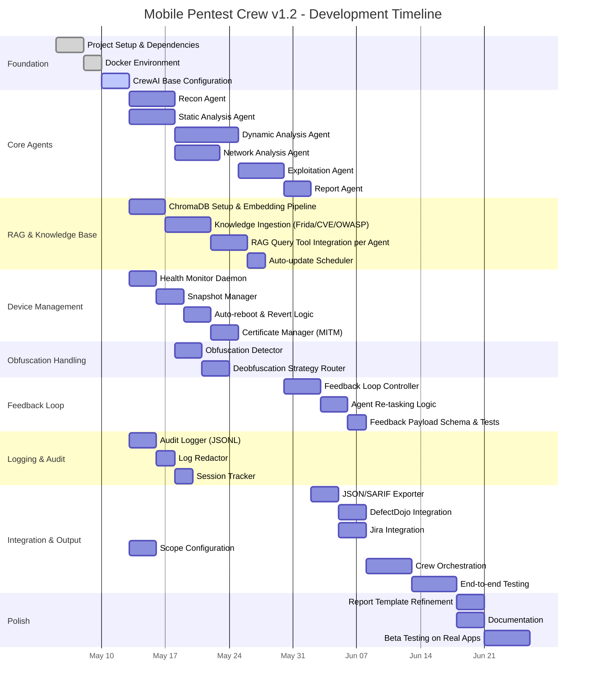

---

## 11. Risk Assessment

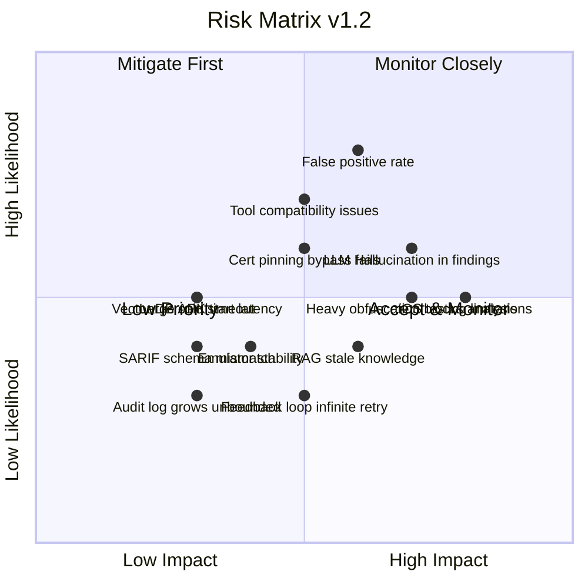

| Risk | Impact | Likelihood | Mitigation |
|------|--------|------------|------------|
| LLM hallucinates vulnerability findings | High | Medium | **Otomatis**: PoC wajib ada sebelum finding dikonfirmasi; confidence < 0.7 → "Unverified"; multi-agent cross-validation (Static + Dynamic keduanya harus detect) |
| Tool compatibility issues | Medium | High | Docker containerization, version pinning di pyproject.toml |
| iOS testing terbatas | High | Medium | Fokus Android MVP; arsitektur didesain extensible; iOS masuk roadmap v2.0 |
| False positive tinggi | High | High | Confidence scoring, multi-agent validation, wajib PoC untuk Critical/High |
| Emulator tidak stabil | Medium | Medium | Health check daemon 30s, auto-restart, snapshot revert < 5 menit |
| RAG knowledge kedaluwarsa | Medium | Medium | Auto-update scheduler weekly; freshness check pada startup; alert jika > 7 hari |
| Feedback loop infinite retry | Medium | Low | Hard limit max 3 iterasi; setelah habis → "Suspected / Unconfirmed" |
| SARIF schema tidak kompatibel | Medium | Low | Unit test per output format; pin ke SARIF v2.1.0; CI test dengan validator |
| Vector DB latency tinggi | Low | Medium | Cache query hasil; pre-warm collection pada startup |
| **Heavy obfuscation blocks static analysis** | High | Medium | Obfuscation detector → fallback ke Dynamic Agent sebagai primary analyzer; catat level obfuscation di laporan |
| **Certificate pinning bypass gagal** | Medium | High | 3-layer bypass (Frida script → Objection → custom hook); jika semua gagal → catat sebagai High finding |
| **Audit log tumbuh tidak terkendali** | Low | Low | Log rotation harian; retention policy per kategori; alert jika disk > 80% |

---

## 12. Security Considerations (Self-Security)

Sistem pentest ini sendiri harus aman untuk menghindari kebocoran data target.

| Area | Risiko | Mitigasi |
|------|--------|----------|
| APK/IPA yang diupload | File berbahaya, ZIP bomb | Sandboxed Docker container, validasi file signature |
| Findings & evidence | Data sensitif dari target | Enkripsi at-rest, akses terbatas via auth |
| RAG Knowledge Base | Poisoning knowledge base | Validasi sumber, hash check pada ingestion |
| LLM API calls | Data APK terkirim ke cloud LLM | Opsi local LLM (Ollama), redaksi data sensitif sebelum ke LLM |
| Output files | SARIF/JSON mengandung secret | Redaksi otomatis credential di snippet evidence |

---

## 13. Success Criteria

| Criteria | Measurement |
|----------|-------------|
| Fungsional | Semua 6 agent dapat berjalan end-to-end |
| Akurasi | > 85% finding ter-verified valid |
| Coverage | > 80% OWASP MASTG test cases ter-cover |
| Waktu | Rata-rata < 4 jam per aplikasi medium (10–50MB) |
| Laporan | Format konsisten, ada remediation |
| **RAG freshness** | Knowledge base diperbarui dalam 7 hari terakhir |
| **Device stability** | < 1% sesi gagal karena device crash yang tidak ter-recover |
| **DevSecOps integration** | Findings ter-import ke DefectDojo tanpa manual editing |
| **Self-correction** | Feedback loop berhasil meningkatkan confirmed vuln rate ≥ 10% |

---

## 14. Out of Scope (v1.0)

- Web application testing
- Server-side penetration testing
- Social engineering attacks
- Physical security testing
- **iOS application testing** — direncanakan pada v2.0; arsitektur agent sudah didesain extensible untuk iOS, namun tool layer (ipsw, class-dump, iOS Simulator) belum diintegrasikan
- Real device farm integration (Corellium / Firebase Test Lab)
- Exploit chaining fully automated tanpa konfirmasi operator
- Hardware security testing (secure enclave, TEE)

---

## 15. Compliance Mapping

Banyak pentest mobile dilakukan untuk memenuhi regulasi atau standar tertentu. Laporan harus dapat memetakan temuan ke standar yang relevan.

### 15.1 Compliance Framework Matrix

| Standard | Relevansi Mobile | Mapped Controls |
|----------|-----------------|----------------|
| **PCI DSS v4.0** | Aplikasi yang menangani data kartu | Req 6.2 (secure development), Req 8 (auth), Req 4 (encryption in transit) |
| **GDPR** | Aplikasi yang mengolah data EU citizens | Data minimization, encryption at rest/transit, right to erasure |
| **OWASP MASVS L1** | Standar minimum semua aplikasi | Mapped via MASTG test cases |
| **OWASP MASVS L2** | Aplikasi high-security (banking, health) | Full MASTG coverage required |
| **ISO 27001** | Umum — information security | A.14 (system acquisition), A.12 (operations security) |
| **HIPAA** | Aplikasi yang tangani health data (US) | Encryption, access control, audit trail |

### 15.2 Compliance Flag di Findings

```json
{
  "id": "VULN-001",
  "compliance_flags": {
    "pci_dss": ["Req 4.2.1", "Req 6.2.4"],
    "owasp_masvs_l1": ["MASVS-NETWORK-1"],
    "owasp_masvs_l2": ["MASVS-NETWORK-2"],
    "gdpr": ["Art. 32 - Security of processing"]
  }
}
```

Compliance flags otomatis ditambahkan oleh Report Agent berdasarkan kategori OWASP MASTG dari setiap finding dan konfigurasi `compliance_profile` di scan scope.

---

## 16. Data Retention & Privacy Policy

Sebagai tool yang memproses data sensitif dari aplikasi target, sistem harus memiliki kebijakan retensi data yang jelas.

### 16.1 Klasifikasi Data

| Tipe Data | Contoh | Sensitivitas | Retensi Default |
|-----------|--------|-------------|----------------|
| APK/IPA file | Target binary | Tinggi | Hapus setelah sesi selesai |
| Decompiled source | Kode hasil decompile | Tinggi | Hapus setelah sesi selesai |
| Findings raw | JSON output penuh | Sedang | 1 tahun, enkripsi at-rest |
| Evidence snippets | Code snippet, log excerpt | Sedang-Tinggi | 1 tahun, redaksi credential |
| Audit logs | JSONL session logs | Rendah-Sedang | Per kategori (lihat Sec. 7d.1) |
| RAG Knowledge Base | Public docs, CVEs | Publik | Indefinite, update berkala |
| LLM API prompts | Prompt + konteks | Sedang | Tidak disimpan (transient) |

### 16.2 Kebijakan Penghapusan

```yaml
# configs/data_retention.yaml
data_retention:
  apk_ipa_files:
    delete_after: "session_end"    # Segera setelah sesi selesai
    location: "docker_volume"

  decompiled_source:
    delete_after: "session_end"
    location: "tmp/"

  findings_json:
    retain_days: 365
    encrypt_at_rest: true
    encryption_key_env: "FINDINGS_ENCRYPTION_KEY"

  evidence_snippets:
    retain_days: 365
    auto_redact_patterns: ["api_key", "password", "token", "secret", "Bearer"]

  llm_prompts:
    persist: false                 # Tidak pernah disimpan ke disk
    redact_before_send: true       # Hapus nilai credential sebelum kirim ke LLM API
```

---

## 17. Appendix

### 17.1 OWASP MASTG Reference

| Category | ID | Test Area |
|----------|----|-----------|
| Storage | MAS-STORAGE | Local data storage security |
| Crypto | MAS-CRYPTO | Cryptographic implementations |
| Auth | MAS-AUTH | Authentication & authorization |
| Network | MAS-NETWORK | Network communication security |
| Platform | MAS-PLATFORM | Platform interaction security |
| Code | MAS-CODE | Code quality & hardening |
| Resilience | MAS-RESILIENCE | Reverse engineering resistance |

### 17.2 Sample Agent Configuration (YAML)

```yaml
# agents.yaml
recon_agent:
  role: "Mobile App Reconnaissance Specialist"
  goal: "Map the complete attack surface of the target mobile application"
  backstory: >
    You are an expert mobile security researcher with deep knowledge
    of Android and iOS internals. You specialize in reverse engineering
    mobile applications to identify all entry points, components,
    and potential attack vectors.
  tools:
    - apktool_wrapper
    - jadx_wrapper
    - adb_wrapper
    - rag_query_tool       # NEW
  verbose: true
  allow_delegation: false

static_analysis_agent:
  role: "Source Code Security Analyst"
  goal: "Identify all static vulnerabilities in the application source"
  backstory: >
    You are a senior mobile security auditor with 10+ years of experience
    in code review. You have an eye for spotting insecure patterns,
    hardcoded secrets, and cryptographic weaknesses. You stay current
    with the latest vulnerability patterns via your knowledge base.
  tools:
    - jadx_wrapper
    - semgrep_scanner
    - pattern_matcher
    - rag_query_tool       # NEW
  verbose: true
  allow_delegation: false

exploitation_agent:
  role: "Vulnerability Exploitation Specialist"
  goal: "Prove vulnerability with working Proof of Concept"
  backstory: >
    You are an offensive security researcher who specializes in
    developing reliable, minimal PoCs for confirmed vulnerabilities.
    When you fail, you analyze why and provide structured feedback
    to request additional context from other agents.
  tools:
    - frida_script_runner
    - nuclei_runner
    - rag_query_tool        # NEW
  verbose: true
  allow_delegation: true    # CHANGED: diperlukan untuk feedback loop
  max_retry: 3              # NEW
```

### 17.3 Sample Task Configuration (YAML)

```yaml
# tasks.yaml
recon_task:
  description: >
    Perform comprehensive reconnaissance on the target mobile application:
    1. Decompile the APK/IPA
    2. Extract and analyze manifest/plist
    3. Enumerate all components (activities, services, receivers, providers)
    4. Identify permissions and their necessity
    5. Extract hardcoded URLs, API endpoints, and secrets
    6. Map the complete attack surface
    7. Query knowledge base for latest recon techniques relevant to this app
  expected_output: >
    A structured reconnaissance report containing:
    - App metadata (package name, version, permissions)
    - Component inventory with export status
    - Extracted URLs and API endpoints
    - Hardcoded secrets found
    - Identified attack surface areas
    - Relevant recent CVEs from knowledge base
  agent: recon_agent

exploitation_task:
  description: >
    Develop and validate Proof of Concept for confirmed vulnerabilities.
    If a bypass fails:
    1. Document what was tried and why it failed
    2. Emit feedback payload to Feedback Loop Controller
    3. Wait for re-tasking with additional context
    4. Retry with updated approach (max 3 attempts)
  expected_output: >
    For each vulnerability:
    - PoC steps (reproducible)
    - Evidence (screenshot/log excerpt)
    - CVSS score
    - Real-world impact statement
    - Feedback loop iterations count
  agent: exploitation_agent
```

### 17.4 DevSecOps Integration Config (YAML)

```yaml
# configs/devsecops.yaml
defectdojo:
  base_url: "https://defectdojo.example.com"
  api_token: "${DEFECTDOJO_API_TOKEN}"
  product_name: "Mobile Pentest Results"
  scan_type: "SARIF"
  auto_push: true
  min_severity_to_push: "medium"

jira:
  base_url: "https://yourorg.atlassian.net"
  api_token: "${JIRA_API_TOKEN}"
  project_key: "SECOPS"
  auto_create_issues: true
  min_severity_to_create: "high"
  labels:
    - "security"
    - "mobile-pentest"
    - "auto-generated"
```

---

*Document version: 1.2.0*
*Generated: 2026-05-03*
*Previous versions: 1.0.0 (initial draft) → 1.1.0 (RAG, Device Mgmt, Feedback Loop, DevSecOps) → 1.2.0 (revisi & penambahan kritis)*
*Next review: After Phase 1 completion*